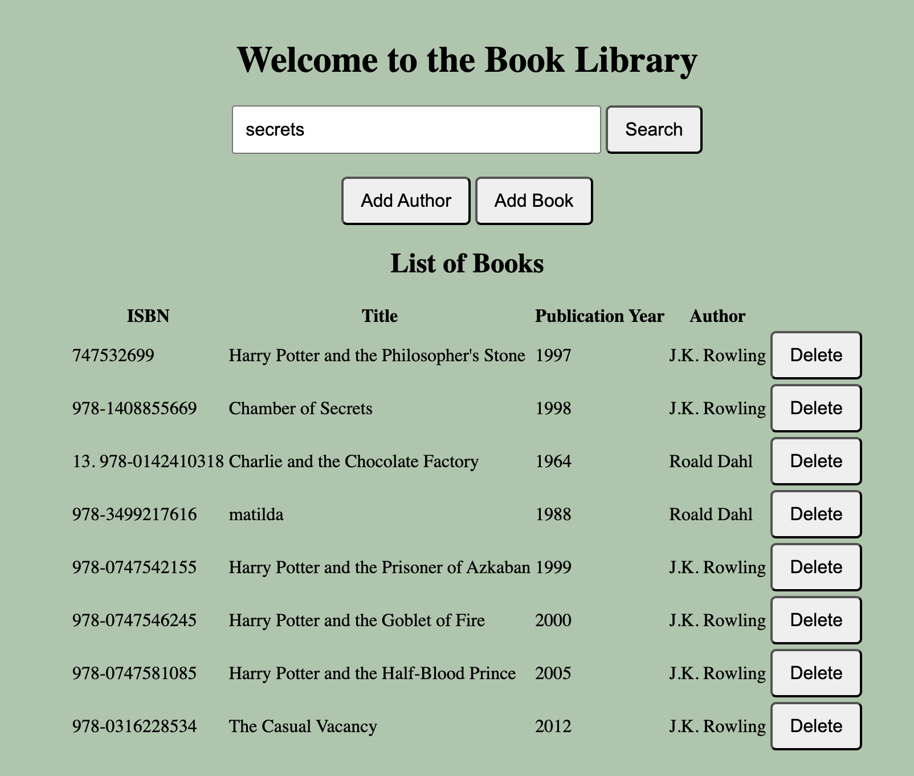
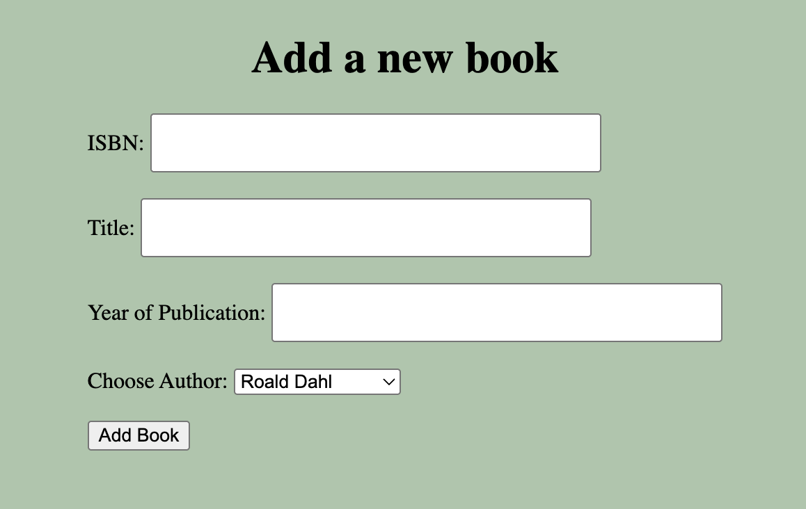
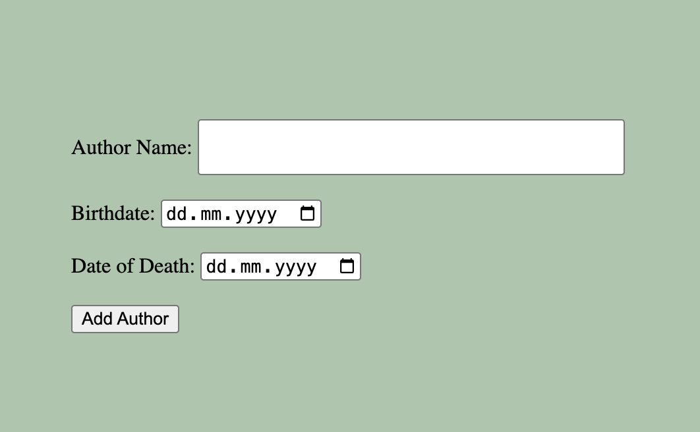
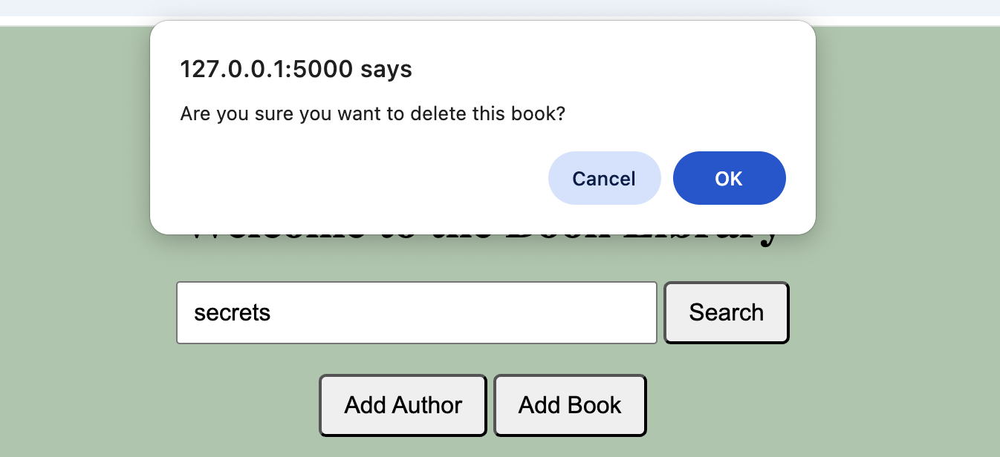

# Book Alchemy 📚 Author and Book Management App 📚

**Book Alchemy** is a web application built using Flask that allows users to manage book library.  
It provides features to view books, add new books and authors . This app allows users to **add** authors, **add** books, **display** list of books and **delete** records.  

## 🛠️ Features

- Display a list of books in the library.

- **Search Books**: Filter books by title for easier searching.
- **Add Books**: Add new books by entering the title, author, ISBN, and publication year.

- **Add Authors**: Add authors with their name and birth/death dates (if applicable).

- Store all data in a **real SQLite database**
- **Delete Record**
- 


## 🛠️ Technologies Used

- **Python**
- **HTML**
- **CSS**
- **SQLite**

## 🚀 How to Run

To get started, simply run the app in a Python environment:

```bash
python app.py
